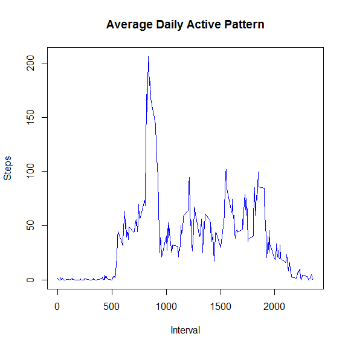

# Reproducible Research: Peer Assessment 1


## Loading and preprocessing the data


```r
data <- read.csv("activity.csv")
data$date <- as.Date(data$date)
```


## What is mean total number of steps taken per day?


```r
good <- data[complete.cases(data),]
x <- tapply(good$steps,good$date,sum)
hist(x,
     main="Histogram of Total Steps Taken Each Day",
     xlab="Steps",
     col="blue")
```

 

```r
## I index this vector to report the mean and median
stepSummary <- summary(x)
```

The mean number of steps in a day is 10770. The median number of steps in a day is 10760.

## What is the average daily activity pattern?


```r
x <- unique(good$interval)
y <- tapply(good$steps, good$interval, mean)
plot(x,y,
     type="l",
     main="Average Daily Active Pattern",
     xlab="Interval",
     ylab="Steps",
     col="blue")
```

 

```r
maxInterval <- which(y==max(y))
```

The 5-minute interval that, on average, contains the maximum number of steps is interval 835 with a value of 206.1698113.

## Imputing missing values
#### Total number of missing values


```r
## I can index this vector to get the number of NA's
badStepSummary <- summary(data$steps)
```

The total number of missing values in the dataset is 2304.

#### Devising a strategy

We want to devise a strategy for filling in all of the missing values in the dataset. The assignment suggests two possible strategies:

1. We can use the mean for that 5-minute interval.
2. We can use the mean/median for that day.

Now, I know that eventually we will want to try to answer questions like "are there differences in activity patterns between weekdays and weekends?". My fear is that filling in missing data with values that are aggregated across days (as in strategy 1 above) will obscure the relationships we hope to look at.

In other words, using the mean (across all days) for a given 5-minute interval as a replacement for missing values makes the data for any day dependent on the data from all the others.

For this reason I am choosing to use strategy 1, and just because we will use the mean.

Or...we would do that...but there is a problem which relates to the distribution of missing values in the dataset. The following is a table of the mean number of steps taken in each day from the raw dataset:


```r
library(xtable)
means <- tapply(data$steps, data$date,mean)
meanDF <- data.frame(date=names(means),mean=means, row.names=NULL)
xt <- xtable(meanDF)
print(xt, type="html")
```

<!-- html table generated in R 3.1.2 by xtable 1.7-4 package -->
<!-- Fri Dec 12 21:27:56 2014 -->
<table border=1>
<tr> <th>  </th> <th> date </th> <th> mean </th>  </tr>
  <tr> <td align="right"> 1 </td> <td> 2012-10-01 </td> <td align="right">  </td> </tr>
  <tr> <td align="right"> 2 </td> <td> 2012-10-02 </td> <td align="right"> 0.44 </td> </tr>
  <tr> <td align="right"> 3 </td> <td> 2012-10-03 </td> <td align="right"> 39.42 </td> </tr>
  <tr> <td align="right"> 4 </td> <td> 2012-10-04 </td> <td align="right"> 42.07 </td> </tr>
  <tr> <td align="right"> 5 </td> <td> 2012-10-05 </td> <td align="right"> 46.16 </td> </tr>
  <tr> <td align="right"> 6 </td> <td> 2012-10-06 </td> <td align="right"> 53.54 </td> </tr>
  <tr> <td align="right"> 7 </td> <td> 2012-10-07 </td> <td align="right"> 38.25 </td> </tr>
  <tr> <td align="right"> 8 </td> <td> 2012-10-08 </td> <td align="right">  </td> </tr>
  <tr> <td align="right"> 9 </td> <td> 2012-10-09 </td> <td align="right"> 44.48 </td> </tr>
  <tr> <td align="right"> 10 </td> <td> 2012-10-10 </td> <td align="right"> 34.38 </td> </tr>
  <tr> <td align="right"> 11 </td> <td> 2012-10-11 </td> <td align="right"> 35.78 </td> </tr>
  <tr> <td align="right"> 12 </td> <td> 2012-10-12 </td> <td align="right"> 60.35 </td> </tr>
  <tr> <td align="right"> 13 </td> <td> 2012-10-13 </td> <td align="right"> 43.15 </td> </tr>
  <tr> <td align="right"> 14 </td> <td> 2012-10-14 </td> <td align="right"> 52.42 </td> </tr>
  <tr> <td align="right"> 15 </td> <td> 2012-10-15 </td> <td align="right"> 35.20 </td> </tr>
  <tr> <td align="right"> 16 </td> <td> 2012-10-16 </td> <td align="right"> 52.38 </td> </tr>
  <tr> <td align="right"> 17 </td> <td> 2012-10-17 </td> <td align="right"> 46.71 </td> </tr>
  <tr> <td align="right"> 18 </td> <td> 2012-10-18 </td> <td align="right"> 34.92 </td> </tr>
  <tr> <td align="right"> 19 </td> <td> 2012-10-19 </td> <td align="right"> 41.07 </td> </tr>
  <tr> <td align="right"> 20 </td> <td> 2012-10-20 </td> <td align="right"> 36.09 </td> </tr>
  <tr> <td align="right"> 21 </td> <td> 2012-10-21 </td> <td align="right"> 30.63 </td> </tr>
  <tr> <td align="right"> 22 </td> <td> 2012-10-22 </td> <td align="right"> 46.74 </td> </tr>
  <tr> <td align="right"> 23 </td> <td> 2012-10-23 </td> <td align="right"> 30.97 </td> </tr>
  <tr> <td align="right"> 24 </td> <td> 2012-10-24 </td> <td align="right"> 29.01 </td> </tr>
  <tr> <td align="right"> 25 </td> <td> 2012-10-25 </td> <td align="right"> 8.65 </td> </tr>
  <tr> <td align="right"> 26 </td> <td> 2012-10-26 </td> <td align="right"> 23.53 </td> </tr>
  <tr> <td align="right"> 27 </td> <td> 2012-10-27 </td> <td align="right"> 35.14 </td> </tr>
  <tr> <td align="right"> 28 </td> <td> 2012-10-28 </td> <td align="right"> 39.78 </td> </tr>
  <tr> <td align="right"> 29 </td> <td> 2012-10-29 </td> <td align="right"> 17.42 </td> </tr>
  <tr> <td align="right"> 30 </td> <td> 2012-10-30 </td> <td align="right"> 34.09 </td> </tr>
  <tr> <td align="right"> 31 </td> <td> 2012-10-31 </td> <td align="right"> 53.52 </td> </tr>
  <tr> <td align="right"> 32 </td> <td> 2012-11-01 </td> <td align="right">  </td> </tr>
  <tr> <td align="right"> 33 </td> <td> 2012-11-02 </td> <td align="right"> 36.81 </td> </tr>
  <tr> <td align="right"> 34 </td> <td> 2012-11-03 </td> <td align="right"> 36.70 </td> </tr>
  <tr> <td align="right"> 35 </td> <td> 2012-11-04 </td> <td align="right">  </td> </tr>
  <tr> <td align="right"> 36 </td> <td> 2012-11-05 </td> <td align="right"> 36.25 </td> </tr>
  <tr> <td align="right"> 37 </td> <td> 2012-11-06 </td> <td align="right"> 28.94 </td> </tr>
  <tr> <td align="right"> 38 </td> <td> 2012-11-07 </td> <td align="right"> 44.73 </td> </tr>
  <tr> <td align="right"> 39 </td> <td> 2012-11-08 </td> <td align="right"> 11.18 </td> </tr>
  <tr> <td align="right"> 40 </td> <td> 2012-11-09 </td> <td align="right">  </td> </tr>
  <tr> <td align="right"> 41 </td> <td> 2012-11-10 </td> <td align="right">  </td> </tr>
  <tr> <td align="right"> 42 </td> <td> 2012-11-11 </td> <td align="right"> 43.78 </td> </tr>
  <tr> <td align="right"> 43 </td> <td> 2012-11-12 </td> <td align="right"> 37.38 </td> </tr>
  <tr> <td align="right"> 44 </td> <td> 2012-11-13 </td> <td align="right"> 25.47 </td> </tr>
  <tr> <td align="right"> 45 </td> <td> 2012-11-14 </td> <td align="right">  </td> </tr>
  <tr> <td align="right"> 46 </td> <td> 2012-11-15 </td> <td align="right"> 0.14 </td> </tr>
  <tr> <td align="right"> 47 </td> <td> 2012-11-16 </td> <td align="right"> 18.89 </td> </tr>
  <tr> <td align="right"> 48 </td> <td> 2012-11-17 </td> <td align="right"> 49.79 </td> </tr>
  <tr> <td align="right"> 49 </td> <td> 2012-11-18 </td> <td align="right"> 52.47 </td> </tr>
  <tr> <td align="right"> 50 </td> <td> 2012-11-19 </td> <td align="right"> 30.70 </td> </tr>
  <tr> <td align="right"> 51 </td> <td> 2012-11-20 </td> <td align="right"> 15.53 </td> </tr>
  <tr> <td align="right"> 52 </td> <td> 2012-11-21 </td> <td align="right"> 44.40 </td> </tr>
  <tr> <td align="right"> 53 </td> <td> 2012-11-22 </td> <td align="right"> 70.93 </td> </tr>
  <tr> <td align="right"> 54 </td> <td> 2012-11-23 </td> <td align="right"> 73.59 </td> </tr>
  <tr> <td align="right"> 55 </td> <td> 2012-11-24 </td> <td align="right"> 50.27 </td> </tr>
  <tr> <td align="right"> 56 </td> <td> 2012-11-25 </td> <td align="right"> 41.09 </td> </tr>
  <tr> <td align="right"> 57 </td> <td> 2012-11-26 </td> <td align="right"> 38.76 </td> </tr>
  <tr> <td align="right"> 58 </td> <td> 2012-11-27 </td> <td align="right"> 47.38 </td> </tr>
  <tr> <td align="right"> 59 </td> <td> 2012-11-28 </td> <td align="right"> 35.36 </td> </tr>
  <tr> <td align="right"> 60 </td> <td> 2012-11-29 </td> <td align="right"> 24.47 </td> </tr>
  <tr> <td align="right"> 61 </td> <td> 2012-11-30 </td> <td align="right">  </td> </tr>
   </table>

Now note that we have done nothing to filter out the missing values in the data. We should expect then that if there is even one value missing in a given day that the function mean() will return an NA (in the table it is displayed as a blank).

It is very interesting then that the table is mostly filled with actual numbers. This means that all the missing values can be found on those few days which have no mean given in the table.

You may be thinking to yourself: "Well, OK, I grant you that is interesting, but you should have just omitted the missing values in your original calculation and been done with it."

I will do exactly that now:


```r
means <- tapply(good$steps, good$date,mean)
meanDF <- data.frame(date=names(means),mean=means, row.names=NULL)
xt <- xtable(meanDF)
print(xt, type="html")
```

<!-- html table generated in R 3.1.2 by xtable 1.7-4 package -->
<!-- Fri Dec 12 21:27:56 2014 -->
<table border=1>
<tr> <th>  </th> <th> date </th> <th> mean </th>  </tr>
  <tr> <td align="right"> 1 </td> <td> 2012-10-02 </td> <td align="right"> 0.44 </td> </tr>
  <tr> <td align="right"> 2 </td> <td> 2012-10-03 </td> <td align="right"> 39.42 </td> </tr>
  <tr> <td align="right"> 3 </td> <td> 2012-10-04 </td> <td align="right"> 42.07 </td> </tr>
  <tr> <td align="right"> 4 </td> <td> 2012-10-05 </td> <td align="right"> 46.16 </td> </tr>
  <tr> <td align="right"> 5 </td> <td> 2012-10-06 </td> <td align="right"> 53.54 </td> </tr>
  <tr> <td align="right"> 6 </td> <td> 2012-10-07 </td> <td align="right"> 38.25 </td> </tr>
  <tr> <td align="right"> 7 </td> <td> 2012-10-09 </td> <td align="right"> 44.48 </td> </tr>
  <tr> <td align="right"> 8 </td> <td> 2012-10-10 </td> <td align="right"> 34.38 </td> </tr>
  <tr> <td align="right"> 9 </td> <td> 2012-10-11 </td> <td align="right"> 35.78 </td> </tr>
  <tr> <td align="right"> 10 </td> <td> 2012-10-12 </td> <td align="right"> 60.35 </td> </tr>
  <tr> <td align="right"> 11 </td> <td> 2012-10-13 </td> <td align="right"> 43.15 </td> </tr>
  <tr> <td align="right"> 12 </td> <td> 2012-10-14 </td> <td align="right"> 52.42 </td> </tr>
  <tr> <td align="right"> 13 </td> <td> 2012-10-15 </td> <td align="right"> 35.20 </td> </tr>
  <tr> <td align="right"> 14 </td> <td> 2012-10-16 </td> <td align="right"> 52.38 </td> </tr>
  <tr> <td align="right"> 15 </td> <td> 2012-10-17 </td> <td align="right"> 46.71 </td> </tr>
  <tr> <td align="right"> 16 </td> <td> 2012-10-18 </td> <td align="right"> 34.92 </td> </tr>
  <tr> <td align="right"> 17 </td> <td> 2012-10-19 </td> <td align="right"> 41.07 </td> </tr>
  <tr> <td align="right"> 18 </td> <td> 2012-10-20 </td> <td align="right"> 36.09 </td> </tr>
  <tr> <td align="right"> 19 </td> <td> 2012-10-21 </td> <td align="right"> 30.63 </td> </tr>
  <tr> <td align="right"> 20 </td> <td> 2012-10-22 </td> <td align="right"> 46.74 </td> </tr>
  <tr> <td align="right"> 21 </td> <td> 2012-10-23 </td> <td align="right"> 30.97 </td> </tr>
  <tr> <td align="right"> 22 </td> <td> 2012-10-24 </td> <td align="right"> 29.01 </td> </tr>
  <tr> <td align="right"> 23 </td> <td> 2012-10-25 </td> <td align="right"> 8.65 </td> </tr>
  <tr> <td align="right"> 24 </td> <td> 2012-10-26 </td> <td align="right"> 23.53 </td> </tr>
  <tr> <td align="right"> 25 </td> <td> 2012-10-27 </td> <td align="right"> 35.14 </td> </tr>
  <tr> <td align="right"> 26 </td> <td> 2012-10-28 </td> <td align="right"> 39.78 </td> </tr>
  <tr> <td align="right"> 27 </td> <td> 2012-10-29 </td> <td align="right"> 17.42 </td> </tr>
  <tr> <td align="right"> 28 </td> <td> 2012-10-30 </td> <td align="right"> 34.09 </td> </tr>
  <tr> <td align="right"> 29 </td> <td> 2012-10-31 </td> <td align="right"> 53.52 </td> </tr>
  <tr> <td align="right"> 30 </td> <td> 2012-11-02 </td> <td align="right"> 36.81 </td> </tr>
  <tr> <td align="right"> 31 </td> <td> 2012-11-03 </td> <td align="right"> 36.70 </td> </tr>
  <tr> <td align="right"> 32 </td> <td> 2012-11-05 </td> <td align="right"> 36.25 </td> </tr>
  <tr> <td align="right"> 33 </td> <td> 2012-11-06 </td> <td align="right"> 28.94 </td> </tr>
  <tr> <td align="right"> 34 </td> <td> 2012-11-07 </td> <td align="right"> 44.73 </td> </tr>
  <tr> <td align="right"> 35 </td> <td> 2012-11-08 </td> <td align="right"> 11.18 </td> </tr>
  <tr> <td align="right"> 36 </td> <td> 2012-11-11 </td> <td align="right"> 43.78 </td> </tr>
  <tr> <td align="right"> 37 </td> <td> 2012-11-12 </td> <td align="right"> 37.38 </td> </tr>
  <tr> <td align="right"> 38 </td> <td> 2012-11-13 </td> <td align="right"> 25.47 </td> </tr>
  <tr> <td align="right"> 39 </td> <td> 2012-11-15 </td> <td align="right"> 0.14 </td> </tr>
  <tr> <td align="right"> 40 </td> <td> 2012-11-16 </td> <td align="right"> 18.89 </td> </tr>
  <tr> <td align="right"> 41 </td> <td> 2012-11-17 </td> <td align="right"> 49.79 </td> </tr>
  <tr> <td align="right"> 42 </td> <td> 2012-11-18 </td> <td align="right"> 52.47 </td> </tr>
  <tr> <td align="right"> 43 </td> <td> 2012-11-19 </td> <td align="right"> 30.70 </td> </tr>
  <tr> <td align="right"> 44 </td> <td> 2012-11-20 </td> <td align="right"> 15.53 </td> </tr>
  <tr> <td align="right"> 45 </td> <td> 2012-11-21 </td> <td align="right"> 44.40 </td> </tr>
  <tr> <td align="right"> 46 </td> <td> 2012-11-22 </td> <td align="right"> 70.93 </td> </tr>
  <tr> <td align="right"> 47 </td> <td> 2012-11-23 </td> <td align="right"> 73.59 </td> </tr>
  <tr> <td align="right"> 48 </td> <td> 2012-11-24 </td> <td align="right"> 50.27 </td> </tr>
  <tr> <td align="right"> 49 </td> <td> 2012-11-25 </td> <td align="right"> 41.09 </td> </tr>
  <tr> <td align="right"> 50 </td> <td> 2012-11-26 </td> <td align="right"> 38.76 </td> </tr>
  <tr> <td align="right"> 51 </td> <td> 2012-11-27 </td> <td align="right"> 47.38 </td> </tr>
  <tr> <td align="right"> 52 </td> <td> 2012-11-28 </td> <td align="right"> 35.36 </td> </tr>
  <tr> <td align="right"> 53 </td> <td> 2012-11-29 </td> <td align="right"> 24.47 </td> </tr>
   </table>

Observe the number of rows (which corresponds to the number of days) in each table. They differ! Upon closer inspection you can see that the days which are not represented in this new table are exactly those days in the first table which had no mean due to missing values. How could a day fail to appear in the second table? It could fail to appear if there was no step data for the entire day.

So we have discovered that:

1. If a day has any data, then all data are present.
2. If a day is missing any data, then no data are present.

This is a fatal problem for our chosen strategy. There is no way for us to fill in the missing values based on the rest of the day's data if no data exists.

I would suggest then that our strategy should be to completely ignore these days. We lose nothing by doing this and end up with a clean data set.

I **would** suggest this, but strictly speaking disregarding missing data isn't imputation (no matter how reasonable it is to do so), and I don't know how literal-minded you, my peer evaluator, are.

Instead we will impute missing values by:

1. determining whether the missing data corresponds to weekday hours or weekend hours.
2. replace the missing value with the average steps taken in the corresponding interval across all days which are likewise during the week or on the weekend.

Here is the code to get the filled dataset:

```r
## A function to determine whether a given observation's date is a weekday or weekend day
dayType <- function(x) {
  if (weekdays(x) %in% c("Saturday","Sunday")) {
    return("weekend")
  } else {
    return("weekday")
  }
}

## Create a new factor variable in the dataset
## with two levels -- "weekday" and "weekend"
## indicating whether a given date is a weekday or weekend day.
data[,"dayType"] <- as.factor(sapply(data$date, dayType))
good <- data[complete.cases(data),]

## This function takes as an argument a single row of a data frame.
## It calculates and returns the proper imputed value.
value <- function(x) {
  mean(good[good$dayType == x$dayType & x$interval == good$interval,"steps"])
}

## We apply the value function to all the incomplete records in the dataset
for (i in 1:nrow(data)) {
  if (is.na(data[i,"steps"])) {
    data[i,"steps"] = value(data[i,])
  }
}
```

There are still dependencies in the data across days (as would occur with strategy 1), but it's clear that we can't avoid that. Better to at least mitigate the effect to some degree.

Here's the Histogram:

```r
x <- tapply(data$steps,data$date,sum)
hist(x,
     main="Histogram of Total Steps Taken Each Day",
     xlab="Steps",
     col="blue")
```

 

```r
## I can index this vector to get the mean and median
stepSummary <- summary(x)
```

The mean number of steps in a day is 10760. The median number of steps in a day is 10570.

## Are there differences in activity patterns between weekdays and weekends?

As part of the assignment we are supposed to "Create a new factor variable in the dataset with two levels -- "weekday" and "weekend" indicating whether a given date is a weekday or weekend day."

Check, we already did that to facilitate the imputation of the missing values.


```r
head(data)
```

```
##       steps       date interval dayType
## 1 2.3333333 2012-10-01        0 weekday
## 2 0.4615385 2012-10-01        5 weekday
## 3 0.1794872 2012-10-01       10 weekday
## 4 0.2051282 2012-10-01       15 weekday
## 5 0.1025641 2012-10-01       20 weekday
## 6 1.5128205 2012-10-01       25 weekday
```

OK, let's make that panel plot!


```r
par(mfcol=c(2,1))
## first plot
x <- unique(data$interval)
y <- tapply(data[data$dayType=="weekend",]$steps, data[data$dayType=="weekend",]$interval, mean)

plot(x,y,
     type="l",
     main="Average Daily Active Pattern (weekend)",
     xlab="Interval",
     ylab="Steps",
     col="blue",
     ylim=c(0,250))

## second plot
y <- tapply(data[data$dayType=="weekday",]$steps, data[data$dayType=="weekday",]$interval, mean)
plot(x,y,
     type="l",
     main="Average Daily Active Pattern (weekday)",
     xlab="Interval",
     ylab="Steps",
     col="blue",
     ylim=c(0,250))
```

 

If you are a peer evaluator, I just want to say thanks for taking the time. There's nothing left that should influence your evaluation, but if you'd like, keep reading. I'm going to follow up with why I specifically chose to have us impute the way we did.

## Why Impute like that?

#### Good question. Here's the answer!

We knew that we would be looking at plots of "average daily activity patterns" and that we would be conditioning (splitting up) our data based on whether that data comes from days during the week or on the weekend.

Ideally, the way we impute missing data would neither supress nor falsely suggest any relationship between the number of steps taken at a given time of day and whether it's the weekend or not. Check out the following:

Say you have a **sample** $x_1,x_2,...,x_n$. Then the **mean** of that sample is:

$$\overline{x} = \frac{x_1+x_2+...+x_n}{n}$$

When we imputed our missing data we had a specific record with a specific time interval. Based on that time interval we collected a **sample** of other data; namely, all the other data at that same time interval (and were likewise on the weekend or during the week). Then we took that sample and calculated its **mean**. Seeing the parallels?

To produce the plots in the final segment of the assignment, we make exactly the same calculation as before but now we have introduced the imputed data to all our samples (there are two samples for each time interval; one for the weekend and one for the week). What effect are these new data going to have on the sample means?

Let $x_{n+1} = \overline{x}$ be one of our new data, where $\overline{x}$ is the old mean. The mean of our new sample $x_1,x_2,...,x_n,x_{n+1}$ is:

$$
  \begin{aligned}
  \frac{x_1+x_2+...+x_n+x_{n+1}}{n+1} 
  & = \frac{n(x_1+x_2+...+x_n)/n+x_{n+1}}{n+1} \\
  & = \frac{n\overline{x}+x_{n+1}}{n+1} \\
  & = \frac{n\overline{x}+\overline{x}}{n+1} \\
  & = \frac{(n+1)\overline{x}}{n+1} \\
  & = \overline{x}
  \end{aligned}
$$

As you can see, with the imputed data defined as it is, There will be no effect whatsoever. It would have been best not to have done anything at all and just ignored the days without data, and it would have been less bothersome for us. This is the next best thing.
